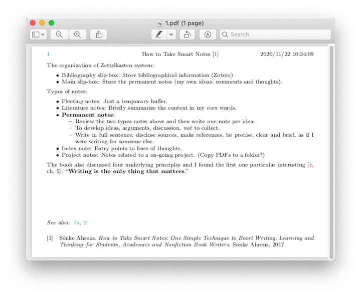
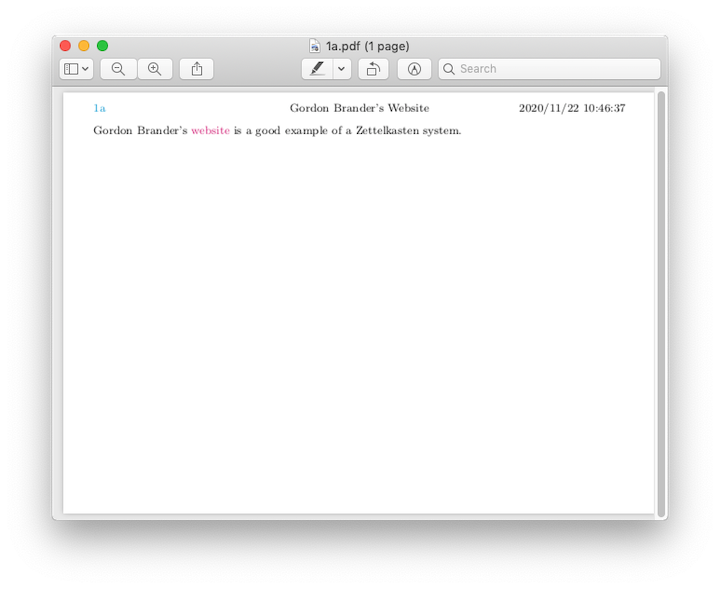
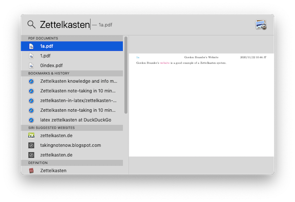

# Simple Zettelkasten Setup in LaTex

A quick introduction of Zettelkasten can be found on
[Wikipedia](https://en.wikipedia.org/wiki/Zettelkasten). For a more in-depth
discussion, Sönke Ahrens has a nice book on the topic [1].

There are many ways to implement such note-taking approach and most of then use
certain general-purpose or specialized note taking software, such as
[Bear.app](https://bear.app), [Evernote](https://evernote.com),
[Obsidian](https://obsidian.md), [Zettlr](https://www.zettlr.com), [The
Archive](https://zettelkasten.de/the-archive/) and
[Roam](https://roamresearch.com). But those tools are not essential in my
opinion, given that the original system was implemented by Niklas Luhmann with
pens, index cards and slip boxes. Luhmann's archive was digitalized and can be
found [here](https://niklas-luhmann-archiv.de) (in German).

I finished Ahrens's book [1] in the fragmented time when I was waiting my dog to
calm down in crate training. I found the idea intriguing and wanted to try it.
But I am little reluctant to invest in a new software at the moment. Instead of
weighing the pros and cons of various software, I would like to start with
something simple and easy to incorporate with my existing workflow. For example,
I use Zotero for bibliography management and VSCode for coding and note taking.

You can find many good advice online on how to start with plain text files and a
text editor for Zettelkasten. Markdown is a popular choice of file format due to
its simplicity and potential to be converted to other formats through software
such as `pandoc`. However, in my field, research papers are mostly typeset in
LaTex and I would like to reuse my notes when writing. With sufficient configuration
and plugins you may make Markdown work nicely with LaTex. But I decided to skip
the hassle and directly note in LaTex.

I quickly set up a simple system for this purpose. A few interesting decisions
were made. First, LaTex instead of Markdown is chosen for the file format. The
reason has been discussed. Second, the page size is limited to A6 instead of the
common A4 or letter size, which better mimics Luhmann's original system (he used
DIN A6 index cards, 148x105mm [1, sec. 3.1]). Third, the file naming method
follows the convention of the original system. A file name is just a number,
bearing no meaning and just as a permanent unique identifier. And related notes
will be named similarly. For example, a new note that is related to an existing
note `1.tex` will be manually named `2.tex` or `1a.tex`. The next related note
will be named `1b.tex` or `1a1.tex` and so on. Fourth, linking is done manually
through LaTex `hyperref` mechanism, facilitated only by a LaTex command
`\zl{n}` which is just `\href{file:n.pdf}{\emph{n}}`.

A smaller page size is chosen because the limited space (hopefully) encourages
precise and brief writing about things that matters. I also like that fact it
mimics the original cards and maybe one day you can print them out, put them in
a slip box, then you have a physical Zettelkasten system, which is pretty cool
(although may not be useful).

File naming and linking are done manually because, if I understand the idea
correctly, they should be a deliberate decisions from you when you review the
notes, think about how they relate to your writing, develop ideas, arguments and
discussions. It's simpler, more portable and software-agnostic (well, it still
relies on LaTex of course).

---

[1] S. Ahrens, How to take smart notes: One simple technique to boost writing, learning and Thinking–for students, academics and nonfiction book writers. Sönke Ahrens, 2017.

## Assumptions

1. Notes are taken in LaTex and reside in one folder.
2. Reviewing and traversing notes are done in PDFs which can be easily compiled
   from LaTex sources with `latexmk`, or other compiler with a build script.
3. PDFs need to be in the same folder because `href` links are linked to PDFs in
   the current directory. For example, in note `1.pdf` a link to note `1a.pdf`
   will be `\href{file:1a.pdf}{1a}`.
4. A bibliography file named `zotero_library.bib` resides in the same folder as
   note LaTex source files.

Of course, some of the assumptions can be relaxed with modifications in the
class file. I encourage you to read the `cls` file and adjust according to your
needs.

## Installation

Put the `jyzk.cls` file in your note source directory.

Or put `jyzk.cls` to your local `texmf` directory.

## Provided commands

`\zl{n}`: creates a new link to the PDF file `n.pdf`.

`\seealso`: creates a "See also:" at the bottom of the card in emphasis.

## Basic Setup

### Folder structure

```text
.
├── 0index.tex
├── 1.tex
├── 1a.tex
├── 2.tex
├── jyzk.cls
├── slipbox
│  ├── 0index.pdf
│  ├── 1.pdf
│  ├── 1a.pdf
│  └── 2.pdf
└── zotero_library.bib
```

### New note

Create a new note with the following template:

```latex
\documentclass{jyzk}
\notetitle{Your note title here}
\notedate{Create time}
\begin{document}

Your note goes here.

% \seealso \zl{}
\end{document}
```

## Optional Setup

### VSCode snippet

A snippet that allows you type `nz` (new zettel) to insert the template:

```json
"New Zettel": {
     "prefix": "nz",
     "body": [
         "\\documentclass{jyzk}",
         "\\notetitle{$1}",
         "\\notedate{$CURRENT_YEAR/$CURRENT_MONTH/$CURRENT_DATE $CURRENT_HOUR:$CURRENT_MINUTE:$CURRENT_SECOND}",
         "\\begin{document}",
         "$0",
         "% \\seealso \\zl{}",
         "\\end{document}",
     ]
 }
```

1. Open the command palette.
2. Call `Preference: Configure User Snippets`.
3. Select `latex.json`.
4. Insert the snippet.

### Zotero

1. Install [Better BibTex](https://retorque.re/zotero-better-bibtex/) plugin.
2. Export your Zotero library in BibTex format and select `Keep Updated`. Your `zotero_library.bib` file will in sync with Zotero. Future
   changes you make to the Zotero will also be synced to the `bib` file.


## Example

### Notes

Index card:


Note 1:


Note 1a:


### Links

File links are highlighted in cyan. Click one will open the corresponding note.
The link on the left header, showing the current note's id, will take you to the
index card.


### Search

Search can be done either in the LaTex source files with your text editor or command
line tools such as `grep` or `rg`. Or in PDF files with system search tools. For
example, on macOS:



